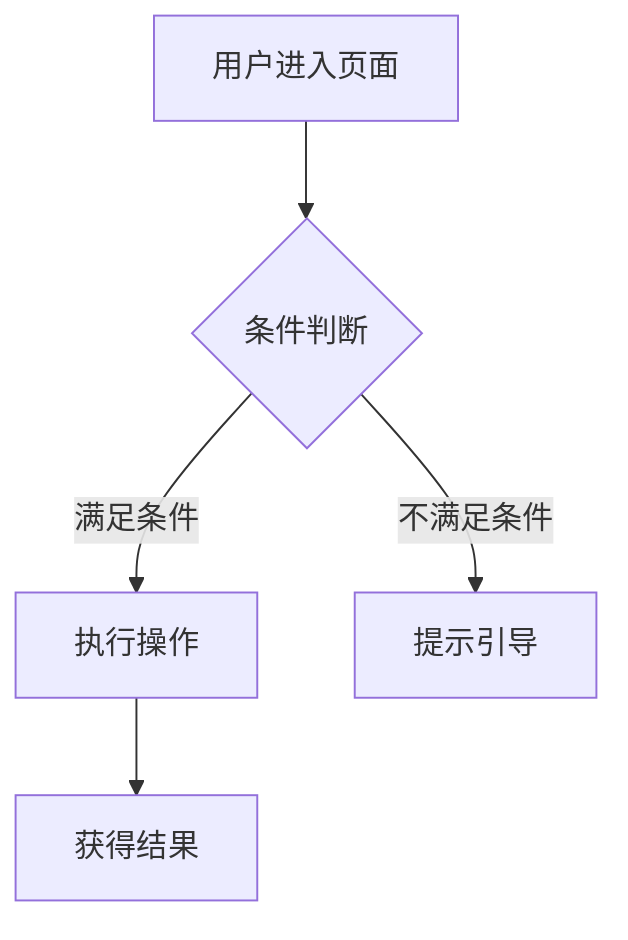

# 撰写高质量结构化产品需求文档（PRD）

帮助用户按行业最佳实践撰写结构化 PRD，融合腾讯产品经理 PRD 框架，支持飞书文档和本地 Markdown 双场景输出。

## 工作流程

### 第一步：需求澄清

不要直接动笔。先通过提问了解核心信息：

1. **问题**：这个需求解决什么问题？用户当前遇到了什么困难？
2. **用户**：目标用户是谁？有什么特征？
3. **成功标准**：怎么判断这个需求做成了？
4. **时间约束**：有明确的 deadline 或版本节点吗？
5. **参考资料**：有原型图、竞品参考、设计稿吗？

如果用户回答模糊，继续追问直到你能清晰回答以上 5 点。

### 第二步：输出格式确认

如果用户没有明确输出格式，询问：

> 你希望输出为 **飞书在线文档**（自动创建、关联 OKR、归档知识库）还是 **本地 Markdown 文件**？

### 第三步：PRD 撰写

按照以下模版结构生成完整 PRD。如果用户对特定章节有特殊要求，以用户要求为准。

### 第四步：飞书集成（仅飞书文档模式）

如果用户选择飞书文档输出：

1. 使用 `lark-doc` skill 创建飞书文档，用户名为「周儒彪」
2. 询问用户是否需要关联 OKR（如果用户没有主动提供 OKR 信息）
3. 如果需要关联 OKR，使用 `lark-okr` skill 创建
4. 询问用户是否需要归档到知识库（如果用户没有指定知识库位置）
5. 如果需要归档，使用 `lark-wiki` skill 操作

### 第五步：评审准备

PRD 生成后，可选提供：
- 评审要点清单（关键决策项、风险点、争议预判）
- 面向不同角色的阅读指引（设计师看什么、前端看什么、后端看什么、测试看什么）

---

## PRD 模版结构

以下结构适用于所有产品类型。每章按需调整详略，但不能跳过。

### 一、文档信息

```markdown
| 项目 | 内容 |
|------|------|
| 文档版本 | V1.0 |
| 产品名 | [产品名称] |
| 子系统/模块 | [子系统名称] |
| 编写人 | [姓名] |
| 编写日期 | YYYY-MM-DD |
| 项目成员 | [角色]：[姓名]；[角色]：[姓名] |

**修订记录**

| 版本 | 修订人 | 修订日期 | 修订描述 |
|------|--------|----------|----------|
| V1.0 | [姓名] | YYYY-MM-DD | 初稿 |
```

### 二、需求背景

**背景概述**：项目的业务背景、市场环境、触发因素。用 2-3 句讲清楚「为什么会有这个需求」。

**需求来源**：谁（角色/部门）提出的、通过什么渠道（用户反馈/数据分析/战略规划/竞品对标）。

**目标用户角色**：

| 用户角色 | 角色描述 | 核心诉求 |
|----------|----------|----------|
| [角色名] | [一句话描述] | [TA 最想解决什么问题] |

**产品目标**：本次需求期望达成的业务目标（定性或定量）。

### 三、需求问题是什么

**核心问题陈述**：用 1-2 句话说清楚现状存在的问题。格式：「当前……导致……」。

**用户痛点**：

1. [痛点 1]：[具体场景下的困难]
2. [痛点 2]：[具体场景下的困难]

**解决思路概述**：大方向上如何解决，不必展开细节。

### 四、为什么是现在处理

**时机分析**：为什么不能延迟处理？（如：配合运营活动节点、竞品已上线类似功能、用户反馈集中爆发、技术债务累积到影响可用性）

**与其他机会的权衡**：当前需求优先于其他候选需求的原因。

**不处理的后果**：如果现在不做，会导致什么。

### 五、需求范围与边界

**范围内（In Scope）**：

- [功能 A]
- [功能 B]

**范围外（Out of Scope）**：

- [不做的功能 X] —— 原因：[为什么本次不做]
- [不做的功能 Y] —— 原因：[为什么本次不做]

**假设与约束条件**：

- [假设 1]
- [约束 1]（如：仅支持 iOS 14+、依赖第三方接口）

### 六、业务流程 / 功能流程图

**核心流程**：用文字描述 + ASCII 流程图或 Mermaid 图表描述主流程，覆盖正常路径。

推荐使用 Mermaid 语法以支持可视化渲染：



**异常流程**：列出关键异常分支及其处理逻辑。

| 异常场景 | 触发条件 | 处理逻辑 |
|----------|----------|----------|
| [场景名] | [条件] | [如何处理] |

### 七、功能清单

| 功能模块 | 功能点 | 细分功能点 | 功能描述 | 优先级 |
|----------|--------|--------|----------|--------|
| [模块A] | [功能点1] | [细分1] | [一句话说明] | P0 |
| [模块A] | [功能点1] | [细分2] | [一句话说明] | P0 |
| [模块A] | [功能点2] | [细分1] | [一句话说明] | P1 |

**优先级定义**：

- **P0**：必须有（MVP，缺少则产品不可用）
- **P1**：应该有（核心体验，缺少则体验不完整）
- **P2**：可以有（锦上添花，资源允许再做）

### 八、需求描述（核心部分）

按功能点逐个拆分，**每个功能点必须遵循以下结构**：

---

**功能点：[功能点名称]**

> **一句话总结**：[用一句话说清楚这个功能点要做什么，加粗突出]

**用户场景**：什么用户在什么情况下会用到此功能。

**前置条件**：触发该功能需要满足的条件（如：已登录、已完成实名认证、网络正常）。

**流程说明**：

| 步骤 | 用户操作 | 系统响应 |
|------|----------|----------|
| 1 | [用户做什么] | [系统怎么响应] |
| 2 | [用户做什么] | [系统怎么响应] |

**交互说明**：

- 页面元素：[列举关键页面元素]
- 手势操作：[如支持的手势：点击/滑动/长按/双击]
- 转场动画：[页面切换方式]
- 加载状态：[加载中展示什么]

**异常情况处理**：

| 异常场景 | 触发条件 | 系统行为 |
|----------|----------|----------|
| 未登录 | 用户未登录时触发功能 | 引导登录，保留上下文 |
| 网络异常 | 请求超时或无网络 | 提示「网络异常，请稍后重试」并提供重试按钮 |
| 权限不足 | 用户无权限访问功能 | 提示说明原因并引导申请权限 |
| 数据为空 | 列表/搜索结果为空 | 展示空状态插图和引导文案 |
| 操作失败 | 提交/保存失败 | 提示错误原因并提供重试 |

**补充说明**：[其他需要研发注意的细节、设计参考链接等]

---

### 九、原型页面 / UI 页面

**页面清单**：

| 页面名称 | 页面路径 | 页面说明 |
|----------|----------|----------|
| [页面A] | [/path] | [一句话说明] |

**页面间跳转关系**：描述页面之间的流转逻辑，可用 Mermaid 或文字描述。

**关键页面原型说明**：对核心页面的布局结构、关键元素、交互逻辑进行文字描述。如果用户提供了原型图或设计稿链接（Figma、蓝湖等），在此引用。

### 十、数据埋点与衡量指标

**成功指标**：

| 指标 | 当前值 | 目标值 | 说明 |
|------|--------|--------|------|
| [指标名] | [基线] | [目标] | [为什么选此指标] |

**埋点需求**：

| 事件ID | 事件名称 | 触发条件 | 自定义参数 |
|--------|----------|----------|------------|
| [event_id] | [名称] | [何时触发] | [参数名: 含义] |

### 十一、非功能需求

**性能需求**：响应时间（如页面加载 <2s）、并发量、可用性（如 99.9%）。

**兼容性需求**：

| 维度 | 要求 |
|------|------|
| 操作系统 | [iOS 15+, Android 11+] |
| 浏览器 | [Chrome 90+, Safari 15+] |
| 屏幕尺寸 | [最小 320px, 最大 1440px] |

**安全需求**：数据加密、权限校验、隐私合规（如 GDPR/个保法）、敏感信息脱敏。

### 十二、风险与依赖

| 风险类型 | 风险描述 | 概率 | 影响 | 缓解措施 |
|----------|----------|------|------|----------|
| 技术风险 | [描述] | 高/中/低 | 高/中/低 | [措施] |
| 业务风险 | [描述] | 高/中/低 | 高/中/低 | [措施] |
| 资源风险 | [描述] | 高/中/低 | 高/中/低 | [措施] |

**外部依赖**：

- [依赖的系统/团队/接口] —— 影响：[什么影响]，对接人：[姓名]

### 十三、附录

- **相关文档**：[链接]
- **评审会议记录**：[链接或此处记录]
- **术语表**：

| 术语 | 说明 |
|------|------|
| [术语] | [解释] |

---

## 撰写原则

以下原则贯穿整个 PRD 撰写过程，优先级高于模版细节：

### 结论先行
每个章节先给总结再分点。让读者快速判断「这部分跟我有没有关系」。

### 从宏观到微观
先写总体（流程、清单、架构），再写具体需求细节。读者应该能在 3 分钟内判断这个需求的整体面貌。

### 异常情况必覆盖
每个功能点必须预判异常场景（未登录、网络异常、数据为空、权限不足、操作失败）。**对异常场景的覆盖程度是区分资深 PM 和初级 PM 的关键**。

### 范围边界清晰
明确「不做什么」比明确「做什么」更有助于防止范围蔓延。Out of Scope 列表必须具体、有理由。

### 优先级驱动
每个功能点标注 P0/P1/P2，支撑团队在资源不足时做 MVP 裁剪。优先级判断标准：
- P0：没有它，这个需求做不了或毫无意义
- P1：没有它，核心体验不完整
- P2：有它更好，但不是必须

### 一句话总结前置
每个需求描述的开头用加粗的一句话总结。让读者扫一眼就知道这个功能点做什么，再决定要不要细读。

### 以读者为中心
PRD 是给别人看的，不是给自己看的。考虑不同角色的诉求：
- **设计师**需要看：背景、用户画像、原型描述
- **前端**需要看：交互说明、状态处理、埋点需求
- **后端**需要看：功能清单、数据关系、异常处理、接口逻辑
- **测试**需要看：功能清单、每个功能点的交互/规则/异常详情
- **运营**需要看：背景、成功指标、功能价值

---

## 产品类型适配

不同产品类型在模版中侧重点不同：

| 产品类型 | 重点调整 |
|----------|----------|
| **移动端 App** | 交互说明要覆盖手势、转场、原生组件；兼容性覆盖 iOS/Android 版本 |
| **小程序** | 注意平台能力限制（包大小、API 限制）；兼容性覆盖微信版本 |
| **Web 端** | 响应式布局说明；浏览器兼容性；SEO 影响（如涉及） |
| **SaaS** | 多租户权限模型；数据隔离；计费/定价影响 |
| **平台工具** | API/接口设计；开发者体验；文档和示例；向后兼容 |

---

## 输出格式

### 飞书文档模式

生成 PRD 后执行：
1. 调用 `lark-doc` 创建飞书文档，格式为 DocxXML，以「周儒彪」身份操作
2. 将完整 PRD 内容写入飞书文档
3. 返回文档链接给用户
4. 询问是否需要创建关联 OKR，如需要则调用 `lark-okr`
5. 询问是否需要归档到知识库，如需要则调用 `lark-wiki`

### 本地 Markdown 模式

将 PRD 保存为 `.md` 文件到用户指定的目录（默认当前工作目录），文件名格式：`PRD-[产品名]-[版本号].md`。

---

## 参考

`references/prd-template.md` 包含完整的空白 PRD 模版（Markdown 格式），可直接复制使用。
