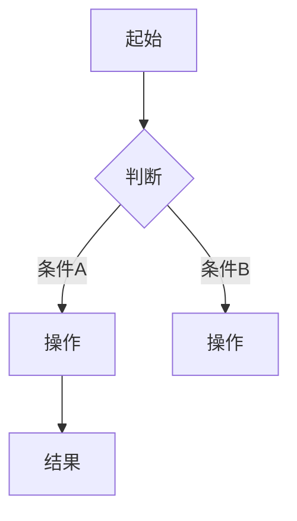

# PRD — [产品名] V[版本号]

---

## 一、文档信息

| 项目 | 内容 |
|------|------|
| 文档版本 | V1.0 |
| 产品名 | [产品名称] |
| 子系统/模块 | [子系统名称] |
| 编写人 | [姓名] |
| 编写日期 | YYYY-MM-DD |
| 项目成员 | [角色]：[姓名] |

**修订记录**

| 版本 | 修订人 | 修订日期 | 修订描述 |
|------|--------|----------|----------|
| V1.0 | [姓名] | YYYY-MM-DD | 初稿 |

---

## 二、需求背景

### 背景概述

[项目的业务背景、市场环境、触发因素]

### 需求来源

[谁提出的、通过什么渠道]

### 目标用户角色

| 用户角色 | 角色描述 | 核心诉求 |
|----------|----------|----------|
| | | |

### 产品目标

[本次需求期望达成的业务目标]

---

## 三、需求问题是什么

### 核心问题陈述

当前……导致……

### 用户痛点

1. **痛点1**：[具体场景下的困难]
2. **痛点2**：[具体场景下的困难]

### 解决思路概述

[大方向上的解决思路]

---

## 四、为什么是现在处理

### 时机分析

[为什么不能延迟处理]

### 与其他机会的权衡

[当前需求优先于其他候选需求的原因]

### 不处理的后果

[如果现在不做会导致什么]

---

## 五、需求范围与边界

### 范围内（In Scope）

- [功能 A]
- [功能 B]

### 范围外（Out of Scope）

- [功能 X] —— 原因：[为什么本次不做]
- [功能 Y] —— 原因：[为什么本次不做]

### 假设与约束条件

- [假设/约束]

---

## 六、业务流程/功能流程图

### 核心流程

### 异常流程

| 异常场景 | 触发条件 | 处理逻辑 |
|----------|----------|----------|
| | | |

---

## 七、功能清单

| 功能模块 | 功能点 | 细分功能点 | 功能描述 | 优先级 |
|----------|--------|--------|----------|--------|
| | | | | P0 |
| | | | | P1 |
| | | | | P2 |

- **P0**：必须有（MVP）
- **P1**：应该有（核心体验）
- **P2**：可以有（锦上添花）

---

## 八、需求描述

### 功能点：[名称]

> **一句话总结**：[用一句话说清楚]

**用户场景**：[什么用户在什么情况下使用]

**前置条件**：[触发该功能需要满足的条件]

**流程说明**：

| 步骤 | 用户操作 | 系统响应 |
|------|----------|----------|
| 1 | | |
| 2 | | |

**交互说明**：

- 页面元素：
- 手势操作：
- 转场动画：
- 加载状态：

**异常情况处理**：

| 异常场景 | 触发条件 | 系统行为 |
|----------|----------|----------|
| 未登录 | | |
| 网络异常 | | |
| 权限不足 | | |
| 数据为空 | | |
| 操作失败 | | |

**补充说明**：

---

（按功能点逐个重复以上结构）

---

## 九、原型页面/UI页面

### 页面清单

| 页面名称 | 页面路径 | 页面说明 |
|----------|----------|----------|
| | | |

### 页面间跳转关系

[描述页面流转逻辑]

### 关键页面原型说明

[核心页面的布局、元素、交互描述]

---

## 十、数据埋点与衡量指标

### 成功指标

| 指标 | 当前值 | 目标值 | 说明 |
|------|--------|--------|------|
| | | | |

### 埋点需求

| 事件ID | 事件名称 | 触发条件 | 自定义参数 |
|--------|----------|----------|------------|
| | | | |

---

## 十一、非功能需求

### 性能需求

[响应时间、并发量、可用性等]

### 兼容性需求

| 维度 | 要求 |
|------|------|
| 操作系统 | |
| 浏览器 | |
| 屏幕尺寸 | |

### 安全需求

[数据安全、权限控制、隐私合规]

---

## 十二、风险与依赖

| 风险类型 | 风险描述 | 概率 | 影响 | 缓解措施 |
|----------|----------|------|------|----------|
| 技术风险 | | | | |
| 业务风险 | | | | |
| 资源风险 | | | | |

### 外部依赖

- [依赖项] —— 影响：[描述]，对接人：[姓名]

---

## 十三、附录

### 相关文档

- [链接]

### 术语表

| 术语 | 说明 |
|------|------|
| | |
